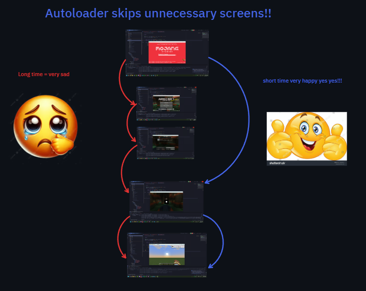

# Save a second, a thousand times

Instead of having to re-open your singleplayer world every time you stop runClient, just have it reopen your world!



## Getting started

For Neoforge 1.21.1, you can just add the jar to your local mods folder.
However, for that and other versions, it can be helpful to add it as a dev dependency.

First, include the azmod maven (https://maven.azmod.net/):

```gradle
maven {
    name = "azmodMavenReleases"
    url = uri("https://maven.azmod.net/releases")
}
```

Then, add the dependency (Versioning is <modversion>+<loader><mcversion>):
```
dependencies {
    //Include the latest version of autoloader for neoforge 1.21.1, other supported versions are available, check CF or MR for availability
    modImplementation("net.azmod:autoloader:[1.0.0,)+neoforge1.21.1")
}
```

## Configurable

By default, it only opens worlds you were playing on at the time that Minecraft stops, as if you reopened the game where you were either in menus or in a world.
If you saved and closed the world, you will just return to the main screen. Autoloader will let you know if you weren't on a world when you closed the game.

If you just want to always load the world no matter what, then the config option is there.